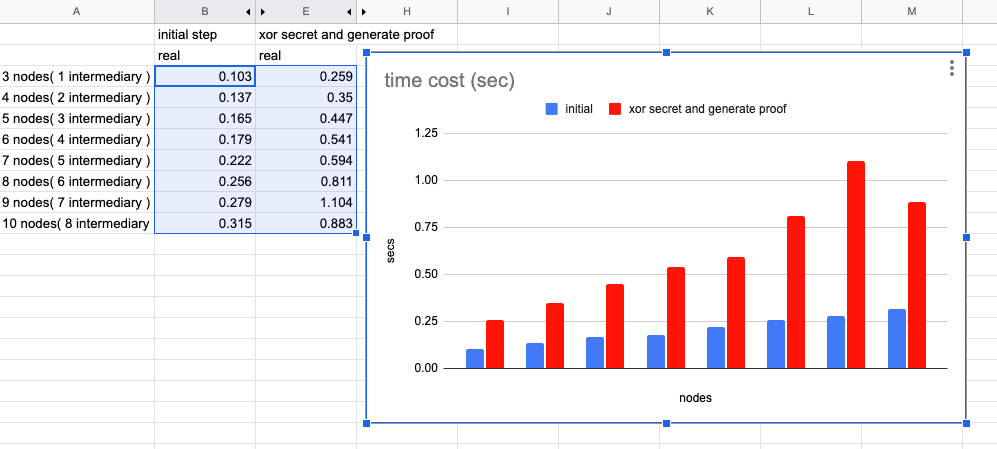

# Path Validation

## prerequisite
Using Ubuntu 16.04
```
$ apt update
$ apt install -y cmake build-essential libssl-dev
```

## Building

```
$ mkdir build && cd build
$ cmake ../ && make
```

## Generate Secret
The host will generate random secrets for each nodes. And the `.secret` files will be stored in the data folder

```
$ ./initialize.sh 10
```

## Generating Proofs
Next, the host could use the secrets to generate proofs. A proof of `ith` could proof that `ith.hash` is the hash of (n xor n-1 xor ... xor i).

```
$ ./genproof.sh 10
```

## Verifying Proofs
Each node uses the verify tool to check if a proof they received is valid or not.

```
// check the 5th proof is valid or not
$ ./verifyproof.sh 5 
verify successfully
```

## Experiment
Using `time` command to determine the execution time of the above script

```
$ time ./initialize.sh 10

real    0m0.315s
user	0m0.017s
sys     0m0.040s
```



## Clear Data
The command `make clean_data` can be used to clear all the files in the data directory

## Exception Notice
Sometimes prover will fail to generate the proofs. The cause is still unknown, but it can be executed again for successed running.
